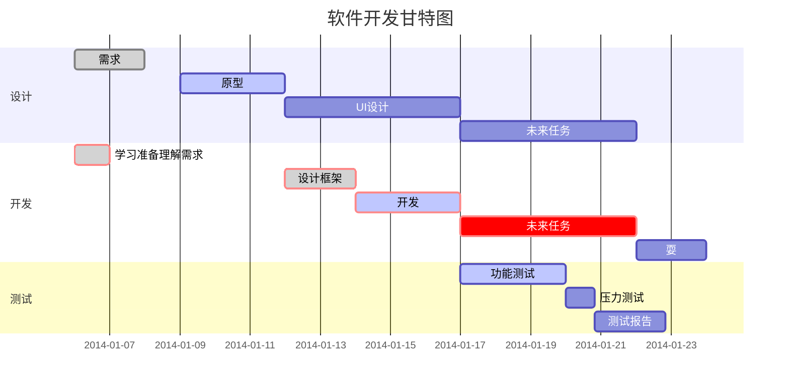

# RUNOOB Markdown Test
## Hello, world! 
## Keep healthy 
# Today
*如果我们把`healthy`看作是一种财富，那么他无疑是我们所能拥有的最珍贵的财富。没有健康，生命便如同没有根基的城堡，随时可能崩塌，健康并非仅仅是身体的强健，它还包括心灵的平和与愉悦。`print('Hello, world! Keep, healthy.')`*  
**一个健康的人，能够充分享受生活的美好，感受阳光的温暖，威风的轻抚，以及世间万物的生机。他不会因为微小的不适而抱怨生活，而是以积极的心态迎接每一天的挑战。健康让我们有精力去追求梦想，去体验生活的丰富多样。**  
***然而，健康并非天生拥有，它需要我们用心去呵护。合理饮食、适度运动、良好的作息习惯，这些都是保持健康的关键。同时，我们还要学会管理情绪，避免过度的压力和焦虑对身体造成伤害。***  
在追求健康的道路上，<u>我们可能会遇到各种困难和诱惑</u>，但只要坚持正确的生活方式，就能让健康成为我们生命中最坚实的后盾[^xyz]。
~~这是多余的一句~~  

故乡的云[^uvw]  

晴天[^rst]   

## 列表
1. xyz
2. uvw
3. rst
* xyz
+ + uvw
  - rst
## 区块
> 稻香
> > 还记得你说家是唯一的城堡 
> > 随着`稻香`河流一起奔跑  
> 微微笑  
> 小时候的梦我知道
> 
> Jay Chou  

> **区块中使用列表**  
> 1. xyz
> 2. uvw
> 3. rst
> * xyz
> * * uvw
> * * * rst

* 列表中使用区块
  > x  
  > 这是x
  >> 别看错了

## 代码

  *代码区块：使用四个空格或一个tab键*

    for i in np.arange(0,10):
      for j in np.arange(0,10):
        print('Hello, world!')

`这个和下面这个常用 print（）`  
*你也可以用 包裹一段代码，并指定一种语言（也可以不指定）：*
```python
print('Hello, world!')
```

## 链接
他说，这是一个链接, [x](http://www.x.com)。  
*别点，*  
*点了也没用。*  
*下面这个你试试看：*  
http://www.runoob.com

听说这是一个链接：[runoob](http://www.runoob.com)    
这也是：[runoob][1]
（下面得有一个空行，链接才有效; 加注释的都需要至少各一个空行）


## 图片


## 表格
|  表头   | 表头  |
|  :----  | ----:  |
|单元格11111|11111单元格|
|单元格|单元格|

| 左对齐 | 右对齐 | 居中对齐 |
| :-----| ----: | :----: |
| 单元格 | 单元格 | 单元格 |
| 单元格 | 单元格 | 单元格 |

## 高级技巧
### 支持的 HTML 元素
不在 Markdown 涵盖范围之内的标签，都可以直接在文档里面用 HTML 撰写。
目前支持的 HTML 元素有：<kbd> <b> <i> <em> <sup> <sub> <br>等 ，如：
使用 <kbd>Ctrl</kbd>+<kbd>Alt</kbd>+<kbd>Del</kbd> 重启电脑

### 转义
!
\!

### 公式
(有点复杂)
$$
\begin{Bmatrix}
   a & b \\
   c & d
\end{Bmatrix}
$$
$$
\begin{CD}
   A @>a>> B \\
@VbVV @AAcA \\
   C @= D
\end{CD}
$$

```python
y=f(x)
```



[1]:http://www.runoob.com  
[^xyz]:http://www.runoob.com  
[^uvw]:uvw   
[^rst]:rst  